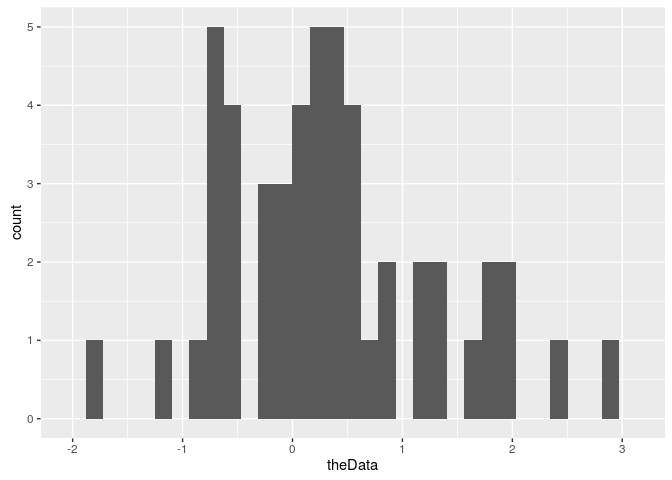
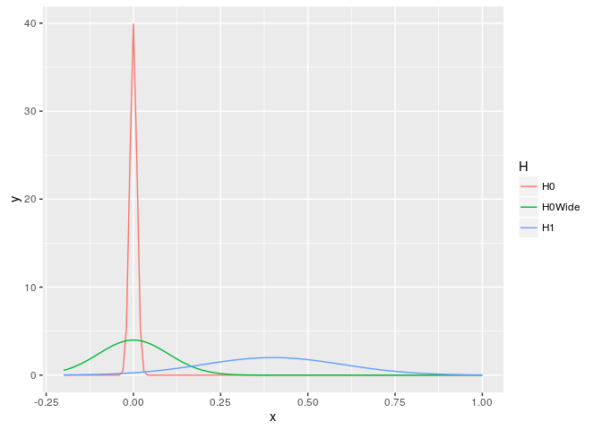
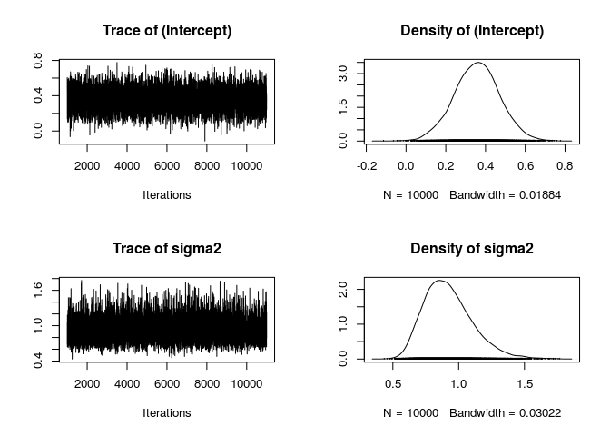
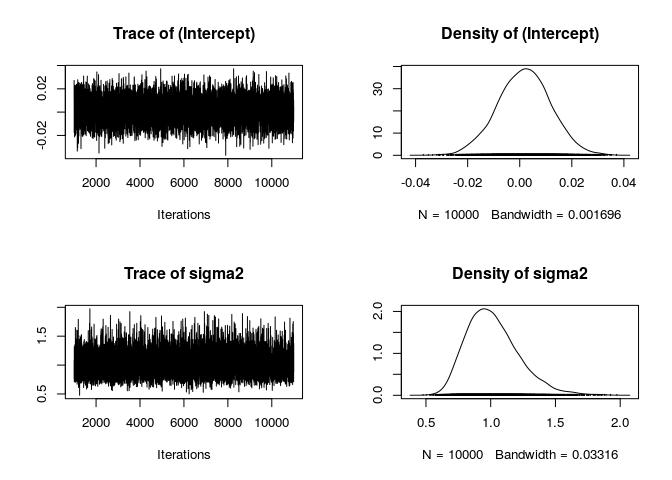

    library(MCMCpack)

    ## Loading required package: coda

    ## Loading required package: MASS

    ## ##
    ## ## Markov Chain Monte Carlo Package (MCMCpack)

    ## ## Copyright (C) 2003-2016 Andrew D. Martin, Kevin M. Quinn, and Jong Hee Park

    ## ##
    ## ## Support provided by the U.S. National Science Foundation

    ## ## (Grants SES-0350646 and SES-0350613)
    ## ##

    library(ggplot2)
    library(dplyr)

    ## 
    ## Attaching package: 'dplyr'

    ## The following object is masked from 'package:MASS':
    ## 
    ##     select

    ## The following objects are masked from 'package:stats':
    ## 
    ##     filter, lag

    ## The following objects are masked from 'package:base':
    ## 
    ##     intersect, setdiff, setequal, union

    set.seed(3243)
    theData <- rnorm(50, .3, 1)

    qplot(theData)

    ## `stat_bin()` using `bins = 30`. Pick better value with `binwidth`.

<!-- -->

    xrange <- seq(-.2, 1, .01)
    H1mu <- .4
    H1sd <- .2
    H0mu <- 0
    H0sd <- .01
    H0sdWide <- .1

    sigma.mu <- 1
    sigma.var <- 100
    priors <- data.frame(x=rep(xrange, 3),
                 y=c(dnorm(xrange, H1mu, H1sd),
                 dnorm(xrange, H0mu, H0sd),
                 dnorm(xrange, H0mu, H0sdWide)),
                 H=rep(c('H1', 'H0', 'H0Wide'), each=length(xrange)))

    ggplot(priors, aes(x=x, y=y, group=H))+
        geom_line(aes(color=H))

<!-- -->

    mean(theData)

    ## [1] 0.3363699

    sd(theData)

    ## [1] 0.9624221

    H1mod <- MCMCregress(theData~1, data=NULL, b0=H1mu, B0=1/H1sd^2,
                 sigma.mu=sigma.mu, sigma.var=sigma.var,
                 marginal.likelihood='Chib95')
    summary(H1mod)

    ## 
    ## Iterations = 1001:11000
    ## Thinning interval = 1 
    ## Number of chains = 1 
    ## Sample size per chain = 10000 
    ## 
    ## 1. Empirical mean and standard deviation for each variable,
    ##    plus standard error of the mean:
    ## 
    ##               Mean     SD Naive SE Time-series SE
    ## (Intercept) 0.3571 0.1138 0.001138       0.001157
    ## sigma2      0.9229 0.1847 0.001847       0.001844
    ## 
    ## 2. Quantiles for each variable:
    ## 
    ##               2.5%    25%    50%    75%  97.5%
    ## (Intercept) 0.1305 0.2820 0.3579 0.4323 0.5817
    ## sigma2      0.6286 0.7887 0.9011 1.0297 1.3474

    plot(H1mod)

<!-- -->

    H0mod <- MCMCregress(theData~1, data=NULL, b0=H0mu, B0=1/H0sd^2,
                 sigma.mu=sigma.mu, sigma.var=sigma.var,
                 marginal.likelihood='Chib95')
    summary(H0mod)

    ## 
    ## Iterations = 1001:11000
    ## Thinning interval = 1 
    ## Number of chains = 1 
    ## Sample size per chain = 10000 
    ## 
    ## 1. Empirical mean and standard deviation for each variable,
    ##    plus standard error of the mean:
    ## 
    ##                 Mean      SD  Naive SE Time-series SE
    ## (Intercept) 0.001778 0.01015 0.0001015      0.0001032
    ## sigma2      1.017579 0.20281 0.0020281      0.0020613
    ## 
    ## 2. Quantiles for each variable:
    ## 
    ##                 2.5%       25%     50%      75%   97.5%
    ## (Intercept) -0.01841 -0.004963 0.00186 0.008568 0.02182
    ## sigma2       0.69587  0.871548 0.99472 1.136074 1.47882

    plot(H0mod)

<!-- -->

    H0Widemod <- MCMCregress(theData~1, data=NULL, b0=H0mu, B0=1/H0sdWide^2,
                 sigma.mu=sigma.mu, sigma.var=sigma.var,
                 marginal.likelihood='Chib95')
    summary(H0Widemod)

    ## 
    ## Iterations = 1001:11000
    ## Thinning interval = 1 
    ## Number of chains = 1 
    ## Sample size per chain = 10000 
    ## 
    ## 1. Empirical mean and standard deviation for each variable,
    ##    plus standard error of the mean:
    ## 
    ##               Mean      SD  Naive SE Time-series SE
    ## (Intercept) 0.1175 0.08352 0.0008352      0.0008766
    ## sigma2      0.9627 0.19509 0.0019509      0.0020505
    ## 
    ## 2. Quantiles for each variable:
    ## 
    ##                2.5%     25%    50%    75%  97.5%
    ## (Intercept) -0.0493 0.06193 0.1179 0.1742 0.2782
    ## sigma2       0.6526 0.82305 0.9384 1.0774 1.4060

    plot(H0Widemod)

<!-- -->

    aBF <- BayesFactor(H1mod, H0mod, H0Widemod)
    summary(aBF)

    ## The matrix of Bayes Factors is:
    ##            H1mod H0mod H0Widemod
    ## H1mod     1.0000 11.14     4.939
    ## H0mod     0.0898  1.00     0.443
    ## H0Widemod 0.2025  2.26     1.000
    ## 
    ## The matrix of the natural log Bayes Factors is:
    ##           H1mod H0mod H0Widemod
    ## H1mod      0.00 2.410     1.597
    ## H0mod     -2.41 0.000    -0.813
    ## H0Widemod -1.60 0.813     0.000
    ## 
    ## There is positive evidence or better to support H1mod over
    ## all other models considered.
    ## 
    ## 
    ## Strength of Evidence Guidelines
    ## (from Kass and Raftery, 1995, JASA)
    ## @@@@@@@@@@@@@@@@@@@@@@@@@@@@@@@@@@@@@@@@@@@@@@@@@@@@@@@@@@@@
    ## 2log(BF[i,j])       BF[i,j]         Evidence Against Model j
    ## ------------------------------------------------------------
    ##   0 to 2            1 to 3           Not worth more than a
    ##                                           bare mention
    ##   2 to 6            3 to 20          Positive
    ##   6 to 10           20 to 150        Strong
    ##   >10               >150             Very Strong
    ## @@@@@@@@@@@@@@@@@@@@@@@@@@@@@@@@@@@@@@@@@@@@@@@@@@@@@@@@@@@@
    ## 
    ## 
    ##  H1mod :
    ##    call = 
    ## MCMCregress(formula = theData ~ 1, data = NULL, b0 = H1mu, B0 = 1/H1sd^2, 
    ##     sigma.mu = sigma.mu, sigma.var = sigma.var, marginal.likelihood = "Chib95")
    ## 
    ##    log marginal likelihood =  -70.76186 
    ## 
    ## 
    ##  H0mod :
    ##    call = 
    ## MCMCregress(formula = theData ~ 1, data = NULL, b0 = H0mu, B0 = 1/H0sd^2, 
    ##     sigma.mu = sigma.mu, sigma.var = sigma.var, marginal.likelihood = "Chib95")
    ## 
    ##    log marginal likelihood =  -73.17223 
    ## 
    ## 
    ##  H0Widemod :
    ##    call = 
    ## MCMCregress(formula = theData ~ 1, data = NULL, b0 = H0mu, B0 = 1/H0sdWide^2, 
    ##     sigma.mu = sigma.mu, sigma.var = sigma.var, marginal.likelihood = "Chib95")
    ## 
    ##    log marginal likelihood =  -72.35907

    t.test(theData)

    ## 
    ##  One Sample t-test
    ## 
    ## data:  theData
    ## t = 2.4714, df = 49, p-value = 0.01698
    ## alternative hypothesis: true mean is not equal to 0
    ## 95 percent confidence interval:
    ##  0.0628526 0.6098873
    ## sample estimates:
    ## mean of x 
    ## 0.3363699
