Use this to look at how false positive rate for 1 sample t.test changes
with a bunch of parameters.

False positive rate
===================

A quick definition: the FPR is the number of false positives (Type-I,
rejection of the null when H0=T) out of the total number of positives
(Type-I errors + true positives).

In math:

$$\\text{fp.rate} = \\frac{\\text{fp}}{\\text{fp} + \\text{tp}}$$

where **fp** is the number of false positives, and **tp** is the number
of true positives *that we are able to detect* (more on that below).

Simulating false positives
==========================

A preview of the heart of the simulation below. Basically, we're going
to look at how the false positive rate changes when you perform a bunch
of study replications (`iter`) each with some number of tests (`tests`,
which you can think of as the number of voxels), for a particular sample
size (`N` observations, i.e., participants, per study). For some
proportion of the tests, the null hypothesis is actually true (that
proportion is `pH0`), and for some, the alternative is true (`pH1`).
Here's the heart of the simulations:

    replicate(iter, data.frame(fp=sum(replicate(round(pH0*tests),
                                               t.test(rnorm(N, 0, 1))$p.value<alpha)),
                              tp=sum(replicate(round(pH1*tests),
                                               t.test(rnorm(N, d, 1))$p.value<alpha)))

I'll gradually build up the above code, from the inside out, following
`fp=` (I'll describe the code following `tp=` below:

1.  We draw *N* random numbers from a normal distribution centered at 0
    (our null hypothesis): **`rnorm(N, 0, 1)`**
2.  We then calculate a 1 sample *t*-test to see what the probability is
    that we would get a set of values like those we drew in (1) if we
    were drawning them from a distribution with a mean that is not equal
    to 0. That is our *p*-value. We check if that *p*-value is \< alpha:
    **`t.test(`**`rnorm(N, 0, 1)`**`)$p.value<alpha`**
3.  We replicate the above for however many of the tests in `tests` are
    supposed to actually have H0=T (`pH0*tests`). So if we have 100
    tests, and 90% are really null effects, we'll replication the code
    in (1-2) 90 times. Putting it all together gives us:

        replicate(round(pH0*tests), t.test(rnorm(N, 0, 1))$p.value<alpha))

4.  We don't save the value of every replicated test out of those 90 --
    we just want to know how many false positives we get -- so we use
    `sum` and save that in the `fp` column. In other words, `fp` will
    become a column where each row is the number of false positives for
    1 of the `iter` studies we're simulating.
5.  Skipping over `tp=` for now, suffice it to say that we want to
    simulate a bunch (however many in `iter`) of studies. So we're going
    to use `replicate` to wrap the whole thing, so that for each study
    in `iter` we create a data.frame that has a count of the false
    positives for that simulated study, as well as a count of the true
    positives.

On average (e.g., over 1000 repetitions), about 5% of the tests where
H0=T in any study should be significant (if alpha=.05). Any given study
may have more or less than 5% of the tests of true-negative voxels
showing activation, but over time, the expectation is that only 5% of
the tests will give a false positive.

FWE
---

When we control the family-wise error rate, we're not trying to just
control the error rate for each test in a particular study. If we were
okay with any given activation being a false positive about 5% of the
time, that would be a fine thing to do. What we're actually going for
with FWE is to control the rate at which we see at least 1 false
activation *out of all the tests*. That is, for some number of tests per
study, say 100, we only want 5% of all studies (each with multiple
tests) to give us one or more false positives. That's why FWE involves
ratcheting down alpha so much (using bonferroni, for example).

To go into this logic a bit further: if you repeat a study consisting of
a single test where the null is actually true, in the long run there is
a 95% chance (if alpha=.05) that any given study will ***not*** yield a
test statistic that has a *p* value less than .05. If you have two tests
per study, there is only a 95% x 95% = 0.9025 chance that *neither* of
the two tests will yield a test statistic with a *p*-value \< .05 (and
so your alpha across the family of those two tests is now effectively
1 - .952 = 0.0975, rather than .05. Intuitively, now you've
got two tests to worry about producing an extreme statistic just by
chance, and it doesn't matter which one does. This problem blows up
pretty quickly. For 100 tests, each with alpha set at .05, your
family-wise alpha becomes 1 - .95100 = 0.994. Yep, that means
out of 1000 studies, each with 100 tests, about 994 of them will have at
least 1 false positive. You'll see this actually happen in our
simulation. Bonferroni correction reduces this problem with brute force
by just decreasing the per-test (or per-voxel) alpha by a factor of the
number of tests. So for 100 test, p\<.05 become p\<.0005, and now our
FWE alpha is 1 - .9995100 = 0.049. It's slightly
conservative, but super easy to apply.

The simulation will show how FWE and the false positive rate both behave
across a range of test-wise alpha levels.

True positives
==============

Again, a preview of the simulation code:

    replicate(iter, data.frame(fp=sum(replicate(round(pH0*tests),
                                               t.test(rnorm(N, 0, 1))$p.value<alpha)),
                              tp=sum(replicate(round(pH1*tests),
                                               t.test(rnorm(N, d, 1))$p.value<alpha)))

In the `replicate` call after `tp=`, we do the same sort of thing as I
described above -- the steps are exactly the same -- except now we draw
our random numbers from a normal distribution centered at our effect
size (say, .2 for a very common psychological effect size):
`rnorm(N, d, 1)`, where `d` is the effect size (the `1` following it is
the standard deviation). In this case, the sum of this set of tests with
*p* \< alpha is the number of true positives out of the proportion of
tests (`pH1`) where we know H1=T (because we've set it up to be true).
The number of true positives out of possible true positives is a
function of power, and indeed, the long-run average proportion of the
number of true positives we can detect out of all of them is going to be
equivalent to power (so if, on average, we detect 2 out of 10 true
positives, our power is .2).

The number of true positives we can detect will go into the total number
of detected activations (*fp + tp*), which will be the denominator of
our false positive rate. So you can already see that power, along with
the number of tests where H1=T out of the total number of tests, will
play a big role in determining the false positive rate.

The Simulation parameters
=========================

So, looking again at the simulation code, above or below, you'll notice
that we get the number of true positives and false positives for each
study a bunch of times -- that's what the first call to
`replicate(iter, ...` is doing. I've set `iter=1000` below, and the
other parameters should match up with the text above, more or less.

You can play with these, though, to see how they effect the numbers we
get out below.

    #percent voxels/clusters etc where H0=T
    pH0 <- .9
    #percent voxels/clusters etc where H1=T
    pH1 <- 1-pH0
    #sample size for 1 study
    N <- 50
    #standardized H1 effect (e.g., d=.2)
    d <- .2
    #alpha level
    alpha <- .05
    #number of tests in 1 study (e.g., voxels)
    tests <- 100
    #number of study replications
    iter <- 1000

    set.seed(1337)

Generate the data... (this takes about 10 seconds on my computer)

    library(dplyr)

    ## 
    ## Attaching package: 'dplyr'

    ## The following objects are masked from 'package:stats':
    ## 
    ##     filter, lag

    ## The following objects are masked from 'package:base':
    ## 
    ##     intersect, setdiff, setequal, union

    simfunction <- function(iter, pH0, pH1, tests, N, alpha, d, summarize.pvals=T) {
        #This code has changed a bit since I wrote the above, 
        #but it still basically works the same way. This
        #just allows one to return each t.test if return.all==T
        if(summarize.pvals){
            manyrepsDF <- bind_rows(replicate(iter, 
                              data_frame(fp=sum(replicate(round(pH0*tests),
                                               t.test(rnorm(N, 0, 1))$p.value<alpha,
                                               simplify=T)),
                                     tp=sum(replicate(round(pH1*tests),
                                               t.test(rnorm(N, d, 1))$p.value<alpha,
                                               simplify=T))),
                              simplify=F))      
            repStats <- within(manyrepsDF, { #For each row do:
                              FWE <- as.numeric(fp>0) #is there at least 1 false positive?
                              total.hits <- fp+tp #how many detections?
                              FP.rate <- fp/total.hits #fp rate
                              fp.prop <- fp/round(pH0*tests) #out of all our tests of H0 voxels, how many positives?
                              tp.prop <- tp/round(pH1*tests) #out of all our tests of H1 voxels, how many positives?
                    })         
            return(repStats)
        } else {
            manyrepsDF.all <-bind_rows(replicate(iter, 
                                 data_frame(fp=list(replicate(round(pH0*tests),
                                              t.test(rnorm(N, 0, 1)),
                                              simplify=F)),
                                    tp=list(replicate(round(pH1*tests),
                                              t.test(rnorm(N, d, 1)),
                                              simplify=F))),
                                 simplify=F))
            return(manyrepsDF.all)
        }
    }

    firstSimFN <- './first_sim.rds'
    if(file.exists(firstSimFN)){
        repStats <- readRDS(firstSimFN)
    } else {
        repStats <- simfunction(iter, pH0, pH1, tests, N, alpha, d)
        saveRDS(repStats, firstSimFN)
    }

Summary of replications
=======================

    #This is a summary of the distribution of the percent of false positives
    library(knitr)
    kable(data.frame(mean=repSums <- round(colMeans(repStats, na.rm=T),4)),
          format='pandoc')

<table>
<thead>
<tr class="header">
<th align="left"></th>
<th align="right">mean</th>
</tr>
</thead>
<tbody>
<tr class="odd">
<td align="left">fp</td>
<td align="right">4.5370</td>
</tr>
<tr class="even">
<td align="left">tp</td>
<td align="right">2.8750</td>
</tr>
<tr class="odd">
<td align="left">tp.prop</td>
<td align="right">0.2875</td>
</tr>
<tr class="even">
<td align="left">fp.prop</td>
<td align="right">0.0504</td>
</tr>
<tr class="odd">
<td align="left">FP.rate</td>
<td align="right">0.6001</td>
</tr>
<tr class="even">
<td align="left">total.hits</td>
<td align="right">7.4120</td>
</tr>
<tr class="odd">
<td align="left">FWE</td>
<td align="right">0.9860</td>
</tr>
</tbody>
</table>

In the summary means above you can see that on average, we get about
4.537 false positives per study, and 2.875 true positives. This gives us
an average false positive rate of 0.6001. Notice that the average
proportion of tests within each study that are false positives is what
we'd expect with alpha = 0.05 (fp.prop = 0.0504). Also notice our
less-than-ideal power of 0.2875. Finally, check out the FWE = 0.986.
That's about what we calculated above, assuming voxel wise alpha is
actually set at .05.

Here are some histograms over our iterations:

    ## `stat_bin()` using `bins = 30`. Pick better value with `binwidth`.

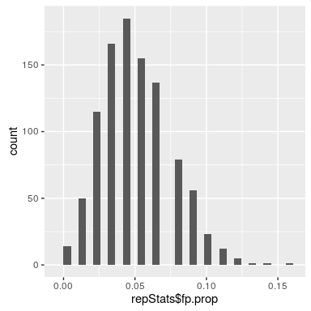<!-- -->

    ## `stat_bin()` using `bins = 30`. Pick better value with `binwidth`.

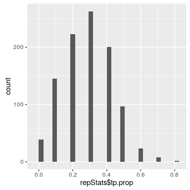<!-- -->

    ## `stat_bin()` using `bins = 30`. Pick better value with `binwidth`.

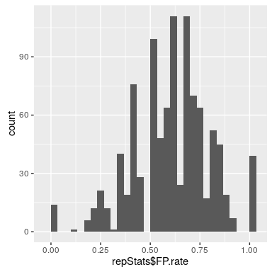<!-- -->

FP Rate at different alphas
===========================

What might be interesting is to see how this stuff changes as we start
to control our FWE, and as our sample size changes (I'm going to leave
our effect size at .2 because this is pretty good guess for effect sizes
and we really don't have much control over this parameter).

    library(parallel)

    fweSimsFN <- './fwe_sims.rds'
    if(file.exists(fweSimsFN)){
        fweSims <- readRDS(fweSimsFN)
    } else {
        fweSims <- mclapply(seq(.05/100, .05, length.out=16), function(x){
                        repStats <- simfunction(iter=1000,
                                    pH0=.9,
                                    pH1=.1,
                                    tests=100,
                                    N=50,
                                    alpha=x,
                                    d=.2)
                        repSums <- data.frame(t(colMeans(repStats, na.rm=T)))
                        repSums$alpha=x
                        return(repSums)
          }, mc.cores=8)
        saveRDS(fweSims, fweSimsFN)
    }
                  
    fweSimsDF <- do.call(rbind, fweSims)

    with(fweSimsDF, qplot(alpha, FWE)+geom_smooth()+scale_x_reverse()+geom_hline(yintercept=.05))

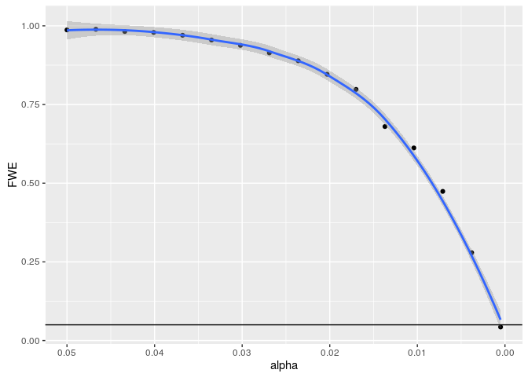<!-- -->

In the above plot, you can see that we improve FWE down to alpha=.05 by
reducing the test- or voxel-wise alpha.

    with(fweSimsDF, qplot(FWE, FP.rate)+geom_smooth()+scale_x_reverse())

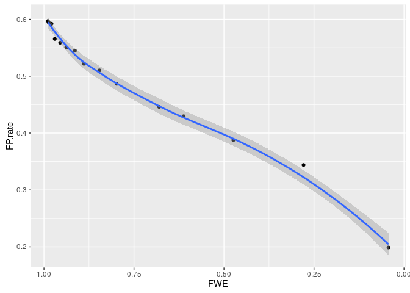<!-- -->

This helps the rate of false positives, which drops as we approach
FWE\<.05.

    with(fweSimsDF, qplot(FWE, tp.prop)+geom_smooth()+scale_x_reverse())

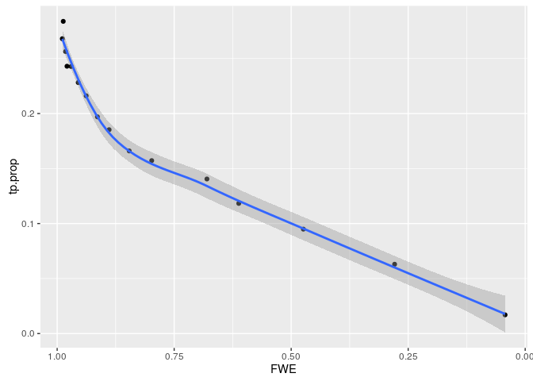<!-- -->

But by controlling FWE we also reduce power (in each study, or
proportion of detected true positives (tp) to total true positives
descends to 0.017. Yep, 1.7% power.

To give you an idea of why the false positive rate goes down even though
*both* false positive detection and true positive detection goes down,
look at this graph:

    with(fweSimsDF, qplot(fp.prop, tp.prop)+geom_smooth()+scale_x_reverse())

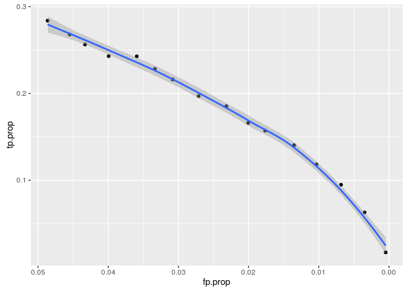<!-- -->

You can see that tp.prop decreases less quickly than fp.prop (at least
at first).

False positive rates in practice (not simulation)
=================================================

Though this simulation can tell us a good deal about the behavior of
false positive rates relative to FWE in general, there is very little we
can actually know about the false positive rate in any given study.
Recall the above formula for calculating the false positive rate:

$$\\text{fp.rate} = \\frac{\\text{fp}}{\\text{fp} + \\text{tp}}$$

Imagine trying to take the number of significant tests (activated
voxels) in some particular study and breaking them out into true
positives (**tp**) and false positives (**fp**). What really matters in
this case is the base rate of true positives and false positives.
Imagine that 99 of the 100 tests are performed on data with a mean that
is really not 0 (H1=T). You'd be right to guess that a lot more of the
positive detections in the denominator ought to arise from those true
effects. Of course, if you knew that, you wouldn't have to science it
out. So how does the false positive rate change as a function of the
proportion of truly H0 tests and truly H1 tests?

In the plots below, I'm going to narrow the range of alpha a bit,
because nobody uses a test-wise alpha=.05. We'll start at .025 and go to
.0005 (bonferroni corrected for 100 tests).

    h0toh1grid <- unlist(apply(expand.grid(pH0=seq(.1, .9, length.out=10),
                  alpha=seq(.05/100, .025, length.out=40)),
                1, list), recursive=F)

    h0SimsFN <- './h0_sims.rds'
    if(file.exists(h0SimsFN)){
        h0Sims <- readRDS(h0SimsFN)
    } else {
        h0Sims <- mclapply(h0toh1grid, function(x){
                       alpha=x['alpha']
                       pH0=x['pH0']
                       repStats <- simfunction(iter=1000,
                                   pH0=pH0,
                                   pH1=1-pH0,
                                   tests=100,
                                   N=50,
                                   alpha=alpha,
                                   d=.2)
                       repSums <- data.frame(t(colMeans(repStats, na.rm=T)))
                       repSums$alpha=alpha
                       repSums$pH0=pH0
                       return(repSums)
          }, mc.cores=8)
        saveRDS(h0Sims, h0SimsFN)
    }

    h0SimsDF <- do.call(rbind, h0Sims)

    h0SimsDF$pH1 <- as.factor(round(1-h0SimsDF$pH0, 2))

    h1graph <- function(yvarname){
        ggplot(h0SimsDF, aes_string(x='alpha', y=yvarname, group='pH1'))+
            geom_vline(xintercept=.0005, color='red', alpha=.5)+
            geom_point(aes(color=pH1))+
            geom_line(aes(color=pH1), stat='smooth', method='loess')+
            scale_x_reverse()
    }

    h1graph('FP.rate')+geom_vline(xintercept=1-exp(log(.3)/100), alpha=.3)

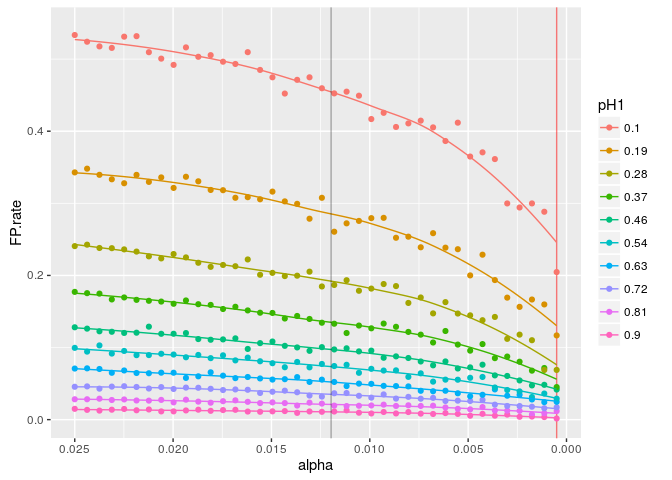<!-- -->

In the above graph, you can see that controlling FWE via test-wise alpha
makes a difference to the false positive rate, but also as a function of
the proportion of H1=T and H0=T tests (pH1 is the proportion of H1=T
tests). And of course in practice, you never know that proportion. To
interpret the y axis in terms of FWE, the gray line is at Eklund et
al.'s estimate of a true FWE of alpha=.7 for some cluster FWE
corrections (70% error level). Depending on the proportion of true
activations to false ones, we get false-positive rates between barely
anything and above 40%.

Even at FWE alpha=.05 (the red line), the potential false positive rate
is pretty broad. This is largely because with *d*=.2 and N=50, we have
very poor power.

    h1graph('tp.prop')  

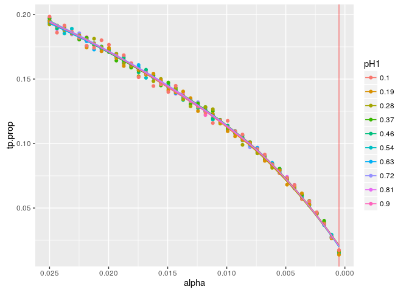<!-- -->

Power is not a function of the proportion of H1=T and H0=T tests.

    h1graph('total.hits')

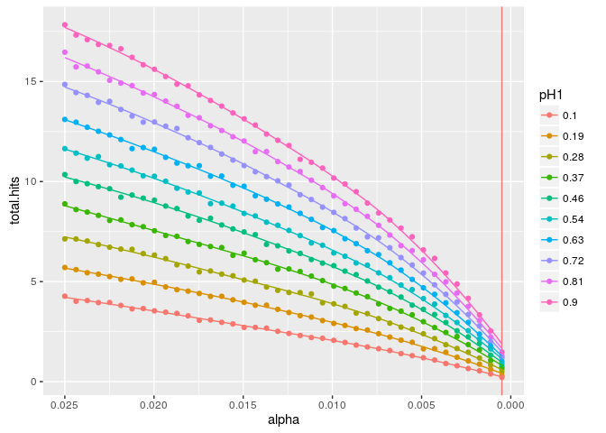<!-- -->

Total hits is a function of H1=T : H0=T.

    h1graph('FWE')+geom_hline(yintercept=.05)+geom_vline(xintercept=1-exp(log(.3)/100), alpha=.3)

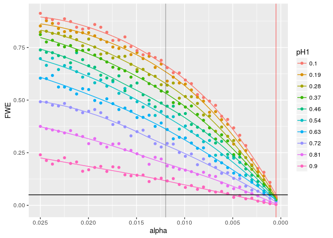<!-- -->

The above graph shows that when you control FWE, you're only setting an
upper limit. Notice that depending on the proportion of true versus
false activations, the actual FWE for any given test-wise alpha can vary
considerably. This limit applies to the case where the proportion of
H1=T tests is 0. If you're in a situation with some tests where H1=T,
your actual FWE is going to be less than this threshold. You can also
see that at our bonferroni corrected test-wise alpha of .0005 (red
vertical line), our FWE is \< .05 (black horizontal line).

Sample Size
===========

Because power is such a huge consideration (and the major problem in the
above graphs), let's do the same thing now varying sample size. We'll
keep alpha constant now at a bonferroni corrected .05/100 = .0005. We'll
also keep *d* at .2 (again, a pretty reasonable effect size estimate).
We can now look at how the false positive rate and power change as a
function of sample size and the proportion of H1=T versus H0=T tests.

    NandH0toH1grid <- unlist(apply(expand.grid(pH0=seq(.1, .9, length.out=10),
                           N=seq(20, 200, length.out=40)),
                       1, list), recursive=F)

    alpha.c <- .05/100

    NandH0SimsFN <- './NandH0_sims.rds'
    if(file.exists(NandH0SimsFN)){
        NandH0Sims <- readRDS(NandH0SimsFN)
    } else {
        NandH0Sims <- mclapply(NandH0toH1grid, function(x){
                           N=x['N']
                           pH0=x['pH0']
                           repStats <- simfunction(iter=1000,
                                       pH0=pH0,
                                       pH1=1-pH0,
                                       tests=tests,
                                       N=N,
                                       alpha=alpha.c,
                                       d=.2)
                           repSums <- data.frame(t(colMeans(repStats, na.rm=T)))
                           repSums$N=N
                           repSums$pH0=pH0
                           return(repSums)
          }, mc.cores=8)
        saveRDS(NandH0Sims, NandH0SimsFN)
    }

    NandH0SimsDF <- do.call(rbind, NandH0Sims)

    NandH0SimsDF$pH1 <- as.factor(round(1-NandH0SimsDF$pH0, 2))

    NandH1graph <- function(yvarname){
        ggplot(NandH0SimsDF, aes_string(x='N', y=yvarname, group='pH1'))+
            geom_point(aes(color=pH1))+
            geom_line(aes(color=pH1), stat='smooth', method='loess')
    }

    NandH1graph('FP.rate') 

<!-- -->

What's a decent FP rate to aim for, anyway? There seems to be a definite
elbow here at about N=100, so maybe that's a good aim. FP rate \< 10% at
d=.2 and 10% H1=T? But for d=.2, power is still terrible at 100 (see
below...a little over 5%).

    NandH1graph('tp.prop') 

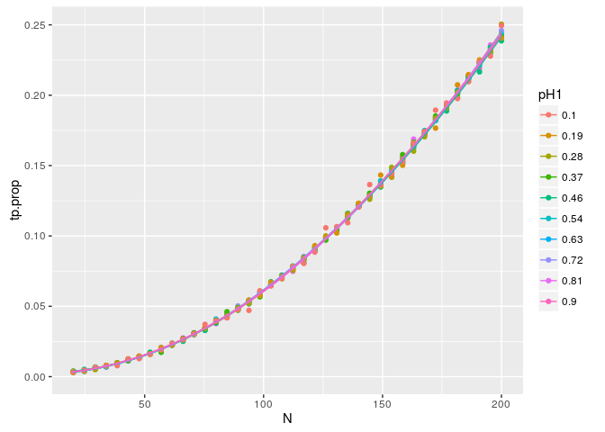<!-- -->

    NandH1graph('total.hits')

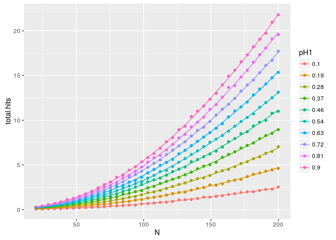<!-- -->

Notice below that the number of false positives out of all the H0=T
tests, and FWE don't care at all about the sample size. And only FWE
cares about the proportion of H0=T and H1=T tetsts, though you're always
below an FWE alpha=.05 if you correct correctly.

    NandH1graph('fp.prop')

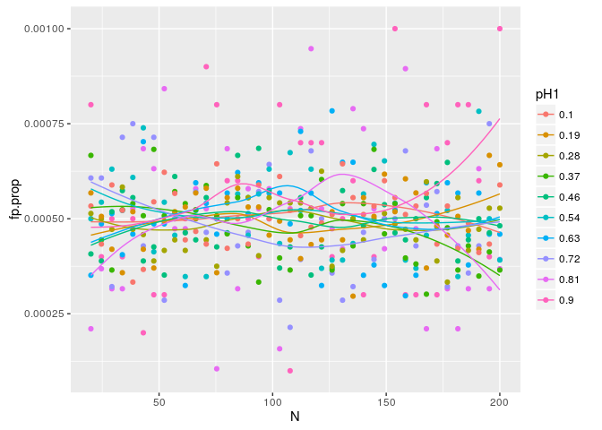<!-- -->

    NandH1graph('FWE')+geom_hline(yintercept=.05)

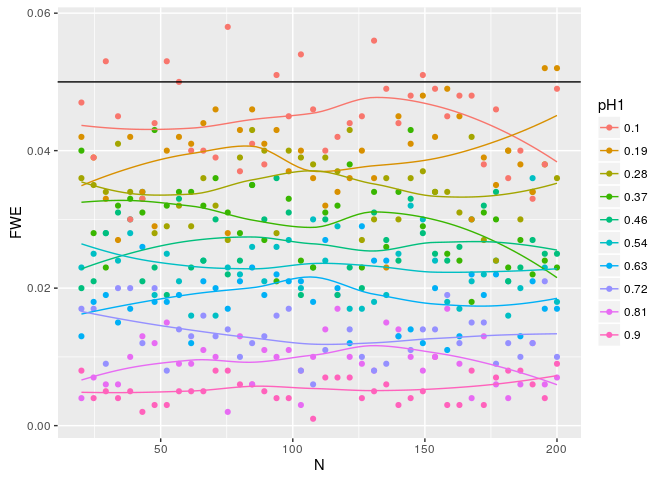<!-- -->

Publication Bias
================

This got me thinking about observed effect sizes in the literature.
Surely, given the false positive rate above, the reported peak voxels in
fMRI studies are a crazy mix of true and false positives. What happens
if we try to recover an effect size from such a data set? What does the
funnel plot look like?

As far as I can tell, even with a small true effect in this data
(*d*=.2), it's hard to tell from the funnel plot that anything is
actually going on. Indeed, I've been skeptical of very similar looking
plots.

Notice that if we just take an average of effect sizes across all
studies, we get a rather inflated estimate, but if we try to regress out
the effect of standard error on the effect size estimate, we
underestimate the true effect size.

    metaGrid <- unlist(apply(expand.grid(alpha=c(.001, .0005), 
                         N=c(30, 60, 120, 240)),
                 1, list), recursive=F)

    metaSimsFN <- './meta_sims.rds'
    if(file.exists(metaSimsFN)){
        metaSims <- readRDS(metaSimsFN)
    } else {
        metaSims <- mclapply(metaGrid, function(x){
                         N=x['N']
                         alpha=x['alpha']
                         someSims <- simfunction(iter=1000,
                                     pH0=.9,
                                     pH1=.1,
                                     tests=100,
                                     N=N,
                                     alpha=alpha,
                                     d=.2,
                                     summarize.pvals=F)
                         return(data_frame(sims=list(someSims),
                                   alpha=alpha,
                                   N=N))
          }, mc.cores=8)
        saveRDS(metaSims, metaSimsFN)
    }

    get.sig.t <- function(x, pcut, opt.info=list()) {
        if(x$p.value<pcut){
            c(list(t=x$statistic, 
                   p=x$p.value),
              opt.info)
        } else {
            list()
        }
    }

    tstats.sig <- bind_rows(metaSims) %>% 
        rowwise %>%
        do({
            THEALPHA <- .$alpha 
            newdf <- .$sims %>%
                mutate(study.id=1:1000) %>%
                rowwise() %>%
                do(bind_rows(bind_rows(lapply(.$fp, get.sig.t, 
                                pcut=THEALPHA,
                                opt.info=list(H0=T,
                                          id=.$study.id))),
                         bind_rows(lapply(.$tp, get.sig.t, 
                                pcut=THEALPHA,
                                opt.info=list(H0=F,
                                          id=.$study.id)))))
            newdf$alpha <- THEALPHA
            newdf$N <- .$N
            newdf
        })

    aDF <- data.frame(N=1:10000)
    mlmData <- bind_rows(aDF, tstats.sig) %>%
        mutate(denom=N^.5,
               sig95=1.96/denom, 
               sig999=3.29/denom,
               sig9995=3.48/denom,
               es=t/denom,
               se=1/denom) 
        
    library(lme4)

    ## Loading required package: Matrix

    ## 
    ## Attaching package: 'lme4'

    ## The following object is masked from 'package:stats':
    ## 
    ##     sigma

    mod001 <- lmer(es~1+se+(1|id), data=subset(mlmData, alpha==.001),
               weights=N)
    summary(mod001)

    ## Linear mixed model fit by REML ['lmerMod']
    ## Formula: es ~ 1 + se + (1 | id)
    ##    Data: subset(mlmData, alpha == 0.001)
    ## Weights: N
    ## 
    ## REML criterion at convergence: -10168.3
    ## 
    ## Scaled residuals: 
    ##     Min      1Q  Median      3Q     Max 
    ## -6.1628 -0.1928  0.0765  0.4031  2.2006 
    ## 
    ## Random effects:
    ##  Groups   Name        Variance Std.Dev.
    ##  id       (Intercept) 0.000    0.000   
    ##  Residual             1.947    1.395   
    ## Number of obs: 6139, groups:  id, 1000
    ## 
    ## Fixed effects:
    ##             Estimate Std. Error t value
    ## (Intercept) 0.100409   0.006074   16.53
    ## se          2.417075   0.084654   28.55
    ## 
    ## Correlation of Fixed Effects:
    ##    (Intr)
    ## se -0.978

    mod001.fx <- fixef(mod001)

    mod0005 <- lmer(es~1+se+(1|id), data=subset(mlmData, alpha==.0005),
            weights=N)
    summary(mod0005)

    ## Linear mixed model fit by REML ['lmerMod']
    ## Formula: es ~ 1 + se + (1 | id)
    ##    Data: subset(mlmData, alpha == 5e-04)
    ## Weights: N
    ## 
    ## REML criterion at convergence: -9429.3
    ## 
    ## Scaled residuals: 
    ##     Min      1Q  Median      3Q     Max 
    ## -7.1779 -0.2618  0.0298  0.3941  2.2852 
    ## 
    ## Random effects:
    ##  Groups   Name        Variance Std.Dev.
    ##  id       (Intercept) 0.000    0.000   
    ##  Residual             1.498    1.224   
    ## Number of obs: 4770, groups:  id, 996
    ## 
    ## Fixed effects:
    ##             Estimate Std. Error t value
    ## (Intercept) 0.101229   0.006601   15.34
    ## se          2.606361   0.093747   27.80
    ## 
    ## Correlation of Fixed Effects:
    ##    (Intr)
    ## se -0.982

    mod0005.fx <- fixef(mod0005)

    library(MASS)

    ## 
    ## Attaching package: 'MASS'

    ## The following object is masked from 'package:dplyr':
    ## 
    ##     select

    mod001.rlm <- rlm(es~1+se, data=subset(mlmData, alpha==.001),
               weights=N)
    summary(mod001.rlm)

    ## 
    ## Call: rlm(formula = es ~ 1 + se, data = subset(mlmData, alpha == 0.001), 
    ##     weights = N)
    ## Residuals:
    ##      Min       1Q   Median       3Q      Max 
    ## -9.23957 -0.35814 -0.06257  0.35444  3.06358 
    ## 
    ## Coefficients:
    ##             Value    Std. Error t value 
    ## (Intercept)   0.0220   0.0022     9.8356
    ## se            3.6386   0.0312   116.7210
    ## 
    ## Residual standard error: 0.529 on 6137 degrees of freedom

    mod001.rlm.fx <- coef(mod001.rlm)

    mod0005.rlm <- rlm(es~1+se, data=subset(mlmData, alpha==.0005),
            weights=N)
    summary(mod0005.rlm)

    ## 
    ## Call: rlm(formula = es ~ 1 + se, data = subset(mlmData, alpha == 5e-04), 
    ##     weights = N)
    ## Residuals:
    ##      Min       1Q   Median       3Q      Max 
    ## -9.16756 -0.34768 -0.06516  0.33065  2.75872 
    ## 
    ## Coefficients:
    ##             Value    Std. Error t value 
    ## (Intercept)   0.0177   0.0026     6.7851
    ## se            3.8645   0.0370   104.5326
    ## 
    ## Residual standard error: 0.5064 on 4768 degrees of freedom

    mod0005.rlm.fx <- coef(mod0005.rlm)

    meanES.0005 <- mean(mlmData$es[mlmData$alpha%in%c(.0005)])
    meanES.001 <- mean(mlmData$es[mlmData$alpha%in%c(.001)])

test-wise alpha \< .001
-----------------------

In the graph below, aside from the anotated lines, the red line is the
true effect size *d* = 0.2, and the blue line is the average effect size
in this sample of study replications (d = 0.29).

    mlmData %>% filter(!alpha%in%c(.001)) %>%
        ggplot(aes(x=1/denom, y=t/denom))+
        geom_hline(yintercept=0)+
        geom_vline(xintercept=0)+
        geom_hline(yintercept=.2, color='red', alpha=.5)+
        geom_hline(yintercept=meanES.001, color='blue', alpha=.5)+
        geom_line(aes(x=1/denom, y=sig95, linetype='p<.05', alpha='p<.05'))+
        geom_line(aes(x=1/denom, y=sig999, linetype='p<.001', alpha='p<.001'))+
        geom_line(aes(x=1/denom, y=sig9995, linetype='p<.0005', alpha='p<.0005'))+
        geom_line(aes(x=1/denom, y=-sig95, linetype='p<.05', alpha='p<.05'))+
        geom_line(aes(x=1/denom, y=-sig999, linetype='p<.001', alpha='p<.001'))+
        geom_line(aes(x=1/denom, y=-sig9995, linetype='p<.0005', alpha='p<.0005'))+
        geom_line(data=data.frame(y=c(mod001.fx['(Intercept)'], 
                          mod001.fx['(Intercept)']+mod001.fx['se']),  
                      x=c(0, 1)), 
              aes(x=x, y=y, linetype='mlm', alpha='mlm'))+
        geom_line(data=data.frame(y=c(mod001.rlm.fx['(Intercept)'], 
                          mod001.rlm.fx['(Intercept)']+mod001.rlm.fx['se']),  
                      x=c(0, 1)), 
              aes(x=x, y=y, linetype='rlm', alpha='rlm'))+
        geom_point(aes(color=H0), alpha=.5, position=position_jitter(h=.01, w=.005))+
        scale_alpha_manual(breaks=c('rlm', 'mlm', 'p<.05', 'p<.001', 'p<.0005'), 
                   values=c('rlm'=1, 'mlm'=1, 'p<.05'=.5, 'p<.001'=.4, 'p<.0005'=.3), 
                   labels=c('rlm est', 'mlm est', 'p<.05', 'p<.001', 'p<.0005'),
                   guide=guide_legend(title='Lines'))+
        scale_linetype_manual(breaks=c('rlm', 'mlm', 'p<.05', 'p<.001', 'p<.0005'), 
                      values=c('rlm'=2, 'mlm'=1, 'p<.05'=3, 'p<.001'=3, 'p<.0005'=3), 
                      labels=c('rlm est', 'mlm est', 'p<.05', 'p<.001', 'p<.0005'),
                      guide=guide_legend(title='Lines'))+
        coord_cartesian(y=c(-1.5,1.5), x=c(-.0005, 1/30^.5))+
        labs(title='Simulated Data: Test-wise alpha<.001',
             x=expression(frac(1,sqrt(N))),
             y=expression(d=frac(Statistic, sqrt(N))))

    ## Warning: Removed 10000 rows containing missing values (geom_point).

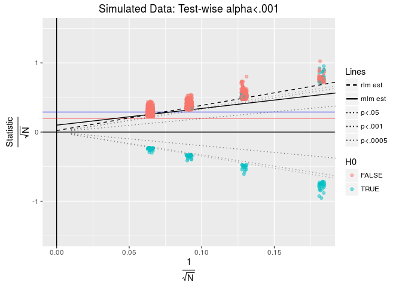<!-- -->

test-wise alpha \< .0005
------------------------

In the graph below, aside from the anotated lines, the red line is the
true effect size *d* = 0.2, and the blue line is the average effect size
in this sample of study replications (d = 0.3).

    mlmData %>% filter(!alpha%in%c(.0005)) %>%
        ggplot(aes(x=1/denom, y=t/denom))+
        geom_hline(yintercept=0)+
        geom_vline(xintercept=0)+
        geom_hline(yintercept=.2, color='red', alpha=.5)+
        geom_hline(yintercept=meanES.0005, color='blue', alpha=.5)+
        geom_line(aes(x=1/denom, y=sig95, linetype='p<.05', alpha='p<.05'))+
        geom_line(aes(x=1/denom, y=sig999, linetype='p<.001', alpha='p<.001'))+
        geom_line(aes(x=1/denom, y=sig9995, linetype='p<.0005', alpha='p<.0005'))+
        geom_line(aes(x=1/denom, y=-sig95, linetype='p<.05', alpha='p<.05'))+
        geom_line(aes(x=1/denom, y=-sig999, linetype='p<.001', alpha='p<.001'))+
        geom_line(aes(x=1/denom, y=-sig9995, linetype='p<.0005', alpha='p<.0005'))+
        geom_line(data=data.frame(y=c(mod0005.fx['(Intercept)'], 
                          mod0005.fx['(Intercept)']+mod0005.fx['se']),  
                      x=c(0, 1)), 
              aes(x=x, y=y, linetype='mlm', alpha='mlm'))+
        geom_line(data=data.frame(y=c(mod0005.rlm.fx['(Intercept)'], 
                          mod0005.rlm.fx['(Intercept)']+mod0005.rlm.fx['se']),  
                      x=c(0, 1)), 
              aes(x=x, y=y, linetype='rlm', alpha='rlm'))+
        geom_point(aes(color=H0), alpha=.5, position=position_jitter(h=.01, w=.005))+
        scale_alpha_manual(breaks=c('rlm', 'mlm', 'p<.05', 'p<.001', 'p<.0005'), 
                   values=c('rlm'=1, 'mlm'=1, 'p<.05'=.5, 'p<.001'=.4, 'p<.0005'=.3), 
                   labels=c('rlm est', 'mlm est', 'p<.05', 'p<.001', 'p<.0005'),
                   guide=guide_legend(title='Lines'))+
        scale_linetype_manual(breaks=c('rlm', 'mlm', 'p<.05', 'p<.001', 'p<.0005'), 
                      values=c('rlm'=2, 'mlm'=1, 'p<.05'=3, 'p<.001'=3, 'p<.0005'=3), 
                      labels=c('rlm est', 'mlm est', 'p<.05', 'p<.001', 'p<.0005'),
                      guide=guide_legend(title='Lines'))+
        coord_cartesian(y=c(-1.5,1.5), x=c(-.0005, 1/30^.5))+
        labs(title='Simulated Data: Test-wise alpha<.0005',
             x=expression(frac(1,sqrt(N))),
             y=expression(d=frac(Statistic, sqrt(N))))

    ## Warning: Removed 10000 rows containing missing values (geom_point).

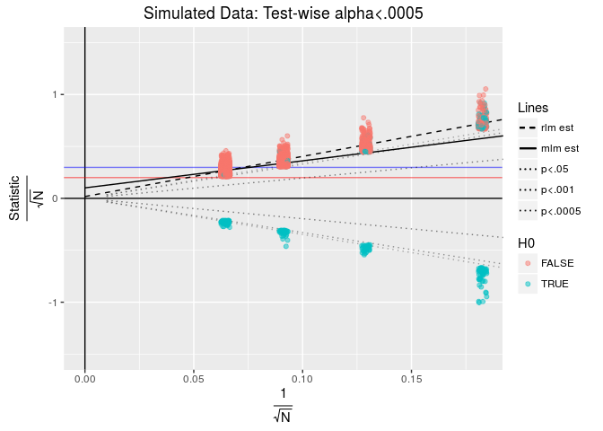<!-- -->
