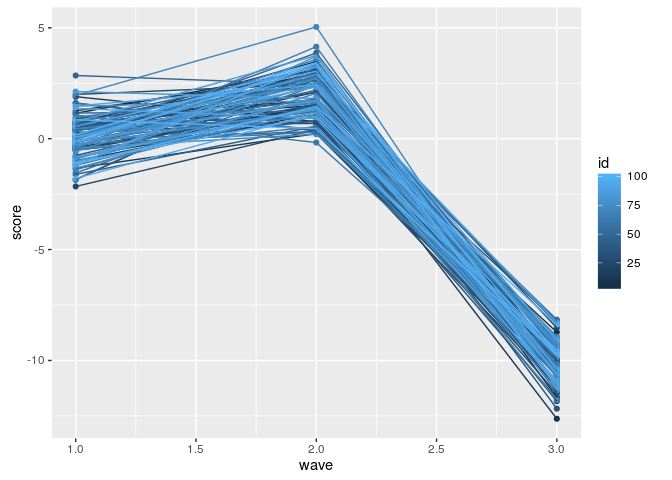

    library(lme4)

    ## Loading required package: Matrix

    ## 
    ## Attaching package: 'lme4'

    ## The following object is masked from 'package:stats':
    ## 
    ##     sigma

    library(ggplot2)

    set.seed(112358)
    adf <- data.frame(wave=rep(c(1,2,3), each=100),
              id=rep(1:100, 3),
              score=c(rnorm(100, 0, 1), 
                  rnorm(100, 2, 1),
                  rnorm(100, -10, 1)))

    summary(adf)

    ##       wave         id             score          
    ##  Min.   :1   Min.   :  1.00   Min.   :-12.62826  
    ##  1st Qu.:1   1st Qu.: 25.75   1st Qu.: -9.47328  
    ##  Median :2   Median : 50.50   Median : -0.03192  
    ##  Mean   :2   Mean   : 50.50   Mean   : -2.72207  
    ##  3rd Qu.:3   3rd Qu.: 75.25   3rd Qu.:  1.40067  
    ##  Max.   :3   Max.   :100.00   Max.   :  5.04081

    ggplot(adf, aes(x=wave, y=score, group=id)) +
        geom_point(aes(color=id))+
        geom_line(aes(color=id))

<!-- -->

    amod <- lmer(score ~ 1 + (1|id) + (1|wave), data=adf)
    summary(amod)

    ## Linear mixed model fit by REML ['lmerMod']
    ## Formula: score ~ 1 + (1 | id) + (1 | wave)
    ##    Data: adf
    ## 
    ## REML criterion at convergence: 862.9
    ## 
    ## Scaled residuals: 
    ##     Min      1Q  Median      3Q     Max 
    ## -2.5001 -0.6971 -0.1136  0.7287  3.1057 
    ## 
    ## Random effects:
    ##  Groups   Name        Variance  Std.Dev. 
    ##  id       (Intercept) 2.285e-12 1.512e-06
    ##  wave     (Intercept) 4.248e+01 6.518e+00
    ##  Residual             9.732e-01 9.865e-01
    ## Number of obs: 300, groups:  id, 100; wave, 3
    ## 
    ## Fixed effects:
    ##             Estimate Std. Error t value
    ## (Intercept)   -2.722      3.763  -0.723

    var.id <- VarCorr(amod)$id["(Intercept)", "(Intercept)"]
    var.wave <- VarCorr(amod)$wave["(Intercept)", "(Intercept)"]
    residual <- sigma(amod)
    total.var <- var.id+var.wave+residual

    (id.icc <- var.id/total.var) #basically nothing

    ## [1] 5.255994e-14

    (wave.icc <- var.wave/total.var) #all of it

    ## [1] 0.9773044
