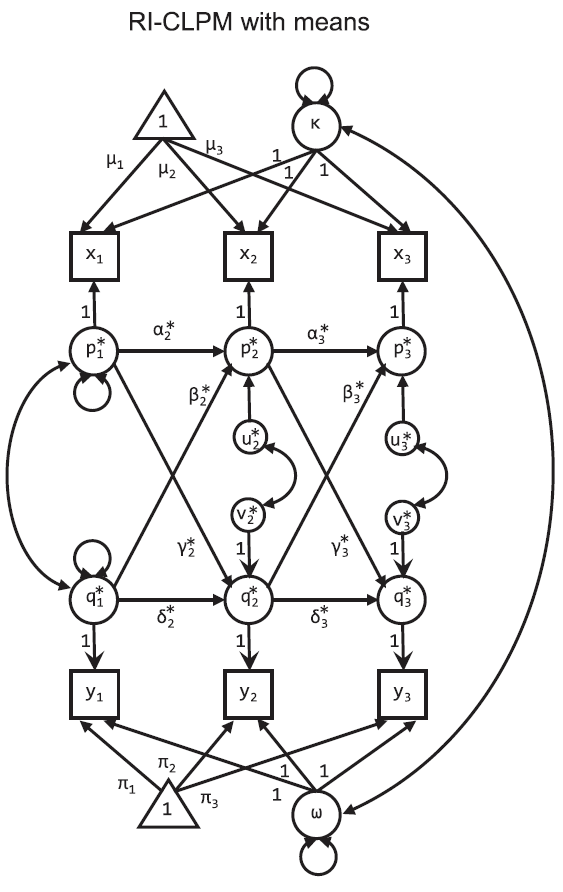

```{r setup, include=FALSE}
knitr::opts_chunk$set(echo = TRUE)
```

# RI-CLPM

This is code for implementing the Random Intercept Cross Lagged Panel Model proposed by Hamaker et al [@Hamakercritiquecrosslaggedpanel2015].

The model looks like this:




The first thing to not is the trick they use to separate out between and within person variance. It's really cool actually. Instead of using the items directly, they model a mean structure for the items, and then essentially turn the residuals of that mean structure into single-indicator factors (with loadings fixed at 1). After you've "extracted" all the mean variance, you perform the cross-lagged analysis on the residuals via these factors. Read the paper for a less...casual...explantion.

# Example data

This is a crack at the code. Please let me know if you see something wrong.

First, we'll load the data

```{r, lavaan demo growth data, message = F, warning = F}
#install.packages('lavaan')
require(lavaan)
require(tidyverse)
data("Demo.growth")

knitr::kable(summary(Demo.growth))

Demo.growth %>%
  mutate(pid = 1:n()) %>%
  gather(key, value, -pid, -x1, -x2) %>%
  extract(col = key, into = c('var', 'wave'), regex = '(\\w)(\\d)') %>%
  ggplot(aes(x = wave, y = value, color = var, group = var)) +
  geom_point(position = position_jitter(w = .2), alpha = .1) +
  geom_line(stat = 'identity', aes(group = interaction(var, pid)), alpha = .04) + 
  geom_line(stat = 'smooth', method = 'lm', size = 1) + 
  theme_classic()
  
```

Well, look at that. The Demo.growth data has two time varrying variables, `t`, and `c`. Just right for our purposes.

In the below `lavaan` code, I'll be using the notaiton from the diagram, except instead of "x" and "y", I'll use "t" and "c". I am explicitly specifying everything in the diagram, which is why in the call to `lavaan` I set a bunch of `auto` options to false. This is because often lavaan will try to automatically estimate things that you don't usually write out but often want estimated, like residuals. Because this model is unorthodox, I want to be as explicit as possible.

# Fitting a RI-CLPM

The lavaan code below uses syntax that can be found in their help docs for the [basic stuff](http://lavaan.ugent.be/tutorial/syntax1.html) as well as the more [advanced](http://lavaan.ugent.be/tutorial/syntax2.html) labelling and constraining.

```{r,lavaan ri-clpm}
riclpmModel <- 
'
#Note, the data contain t1-3 and c1-3
#Latent mean Structure with intercepts

kappa =~ 1*t1 + 1*t2 + 1*t3
omega =~ 1*c1 + 1*c2 + 1*c3

t1 ~ mu1*1 #intercepts
t2 ~ mu2*1
t3 ~ mu3*1
c1 ~ pi1*1
c2 ~ pi2*1
c3 ~ pi3*1

kappa ~~ kappa #variance
omega ~~ omega #variance
kappa ~~ omega #covariance

#laten vars for AR and cross-lagged effects
p1 =~ 1*t1 #each factor loading set to 1
p2 =~ 1*t2
p3 =~ 1*t3
q1 =~ 1*c1
q2 =~ 1*c2
q3 =~ 1*c3

#constrain autoregression and cross lagged effects to be the same across both lags.
p3 ~ alpha3*p2 + beta3*q2
p2 ~ alpha2*p1 + beta2*q1

q3 ~ delta3*q2 + gamma3*p2
q2 ~ delta2*q1 + gamma2*p1

p1 ~~ p1 #variance
p2 ~~ u2*p2
p3 ~~ u3*p3
q1 ~~ q1 #variance
q2 ~~ v2*q2
q3 ~~ v3*q3

p1 ~~ q1 #p1 and q1 covariance
p2 ~~ q2 #p2 and q2 covariance
p3 ~~ q3 #p2 and q2 covariance'

fit <- lavaan(riclpmModel, data = Demo.growth,
              int.ov.free = F,
              int.lv.free = F,
              auto.fix.first = F,
              auto.fix.single = F,
              auto.cov.lv.x = F,
              auto.cov.y = F,
              auto.var = F)
summary(fit)
```

I'm not sure why some variances are negative, except that this is probably an artificial data set. If you try this on your own real data and get the same problem, please let me know.

# References